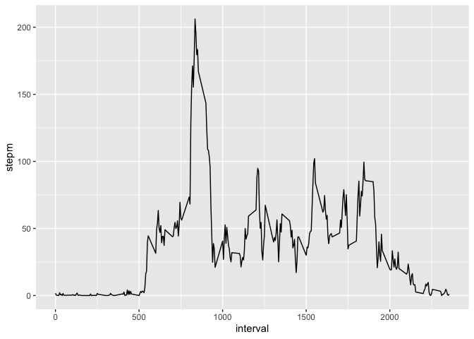
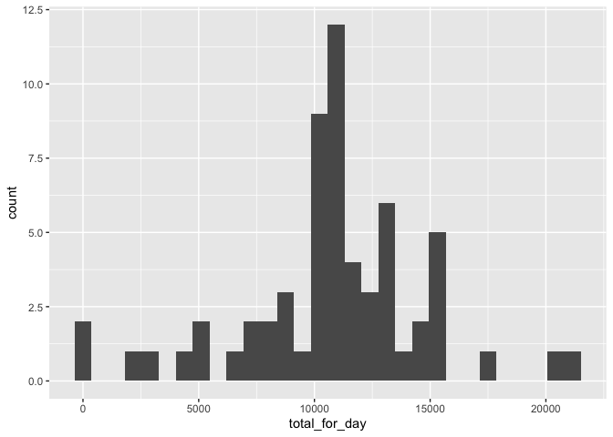
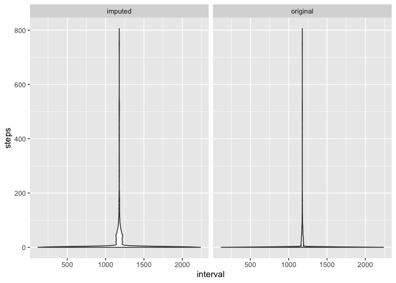
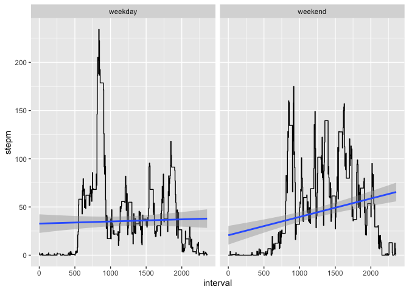

## Loading and preprocessing the data

- The data is in the CWD, file activity.zip
- Lets load it already! 

```r
library(readr)
activity<-read_csv("activity.zip",col_types = cols(
  steps = col_double(),
  date = col_date(format = ""),
  interval = col_double()
))
head(activity)
```

```
## # A tibble: 6 x 3
##   steps date       interval
##   <dbl> <date>        <dbl>
## 1    NA 2012-10-01        0
## 2    NA 2012-10-01        5
## 3    NA 2012-10-01       10
## 4    NA 2012-10-01       15
## 5    NA 2012-10-01       20
## 6    NA 2012-10-01       25
```

```r
dim(activity)
```

```
## [1] 17568     3
```

```r
str(activity)
```

```
## Classes 'spec_tbl_df', 'tbl_df', 'tbl' and 'data.frame':	17568 obs. of  3 variables:
##  $ steps   : num  NA NA NA NA NA NA NA NA NA NA ...
##  $ date    : Date, format: "2012-10-01" "2012-10-01" ...
##  $ interval: num  0 5 10 15 20 25 30 35 40 45 ...
##  - attr(*, "spec")=
##   .. cols(
##   ..   steps = col_double(),
##   ..   date = col_date(format = ""),
##   ..   interval = col_double()
##   .. )
```

```r
summary(activity)
```

```
##      steps             date               interval     
##  Min.   :  0.00   Min.   :2012-10-01   Min.   :   0.0  
##  1st Qu.:  0.00   1st Qu.:2012-10-16   1st Qu.: 588.8  
##  Median :  0.00   Median :2012-10-31   Median :1177.5  
##  Mean   : 37.38   Mean   :2012-10-31   Mean   :1177.5  
##  3rd Qu.: 12.00   3rd Qu.:2012-11-15   3rd Qu.:1766.2  
##  Max.   :806.00   Max.   :2012-11-30   Max.   :2355.0  
##  NA's   :2304
```
So there we go! Now for some extra date data we might need down the road:

```r
 #Always. I have no idea what people did before dplyr
library(dplyr)
```

```
## 
## Attaching package: 'dplyr'
```

```
## The following objects are masked from 'package:stats':
## 
##     filter, lag
```

```
## The following objects are masked from 'package:base':
## 
##     intersect, setdiff, setequal, union
```

```r
#We will need some date work for most of the rest of the work, 
#might as well include this now
library(lubridate)
```

```
## 
## Attaching package: 'lubridate'
```

```
## The following object is masked from 'package:base':
## 
##     date
```

```r
#Fill activity with a bunch of interesting date stuff:
#I just find it better/more readable in the end for dplyr
activity$weekday<-weekdays(activity$date)
activity$month<-months(activity$date)
activity$day<-day(activity$date)
activity$year<-year(activity$date)
```

So now things look like this:


```r
head(activity)
```

```
## # A tibble: 6 x 7
##   steps date       interval weekday month     day  year
##   <dbl> <date>        <dbl> <chr>   <chr>   <int> <dbl>
## 1    NA 2012-10-01        0 Monday  October     1  2012
## 2    NA 2012-10-01        5 Monday  October     1  2012
## 3    NA 2012-10-01       10 Monday  October     1  2012
## 4    NA 2012-10-01       15 Monday  October     1  2012
## 5    NA 2012-10-01       20 Monday  October     1  2012
## 6    NA 2012-10-01       25 Monday  October     1  2012
```

```r
str(activity)
```

```
## Classes 'spec_tbl_df', 'tbl_df', 'tbl' and 'data.frame':	17568 obs. of  7 variables:
##  $ steps   : num  NA NA NA NA NA NA NA NA NA NA ...
##  $ date    : Date, format: "2012-10-01" "2012-10-01" ...
##  $ interval: num  0 5 10 15 20 25 30 35 40 45 ...
##  $ weekday : chr  "Monday" "Monday" "Monday" "Monday" ...
##  $ month   : chr  "October" "October" "October" "October" ...
##  $ day     : int  1 1 1 1 1 1 1 1 1 1 ...
##  $ year    : num  2012 2012 2012 2012 2012 ...
##  - attr(*, "spec")=
##   .. cols(
##   ..   steps = col_double(),
##   ..   date = col_date(format = ""),
##   ..   interval = col_double()
##   .. )
```


## What is mean total number of steps taken per day?

Documentation of our assignment states:

>For this part of the assignment, you can ignore the missing values in the dataset.
>Calculate the total number of steps taken per day


```r
#Mkay then
activity_for_day<-activity %>%group_by(date) %>% summarise(
  total_for_day=sum(steps,na.rm=TRUE), 
  mean_for_day=mean(steps,na.rm = TRUE)) 

activity %>%
  group_by(date)%>% 
  na.omit()%>% 
  filter(steps!=0) %>% #Median by excluding zeros, in case we need it
  summarise(median_for_day=median(steps))->median_per_day

head(activity_for_day)
```

```
## # A tibble: 6 x 3
##   date       total_for_day mean_for_day
##   <date>             <dbl>        <dbl>
## 1 2012-10-01             0      NaN    
## 2 2012-10-02           126        0.438
## 3 2012-10-03         11352       39.4  
## 4 2012-10-04         12116       42.1  
## 5 2012-10-05         13294       46.2  
## 6 2012-10-06         15420       53.5
```

```r
head(median_per_day)
```

```
## # A tibble: 6 x 2
##   date       median_for_day
##   <date>              <dbl>
## 1 2012-10-02           63  
## 2 2012-10-03           61  
## 3 2012-10-04           56.5
## 4 2012-10-05           66  
## 5 2012-10-06           67  
## 6 2012-10-07           52.5
```
>If you do not understand the difference between a histogram and a barplot, research the difference between them. Make a histogram of the total number of steps taken each day

This plots the histogram of the summary of steps taken each day

```r
library(ggplot2)
activity_for_day%>% 
  select(date,total_for_day) %>% 
  ggplot(aes(total_for_day))+geom_histogram()
```

```
## `stat_bin()` using `bins = 30`. Pick better value with `binwidth`.
```

<!-- -->

>Calculate and report the mean and median of the total number of steps taken per day

The following summary tells us the Median and Mean of the total number of steps taken per day

```r
summary(activity_for_day$total_for_day)
```

```
##    Min. 1st Qu.  Median    Mean 3rd Qu.    Max. 
##       0    6778   10395    9354   12811   21194
```

## What is the average daily activity pattern?

>Make a time series plot (i.e. type="l") of the 5-minute interval (x-axis) and the average number of steps taken, averaged across all days (y-axis)
 

```r
activity%>%select(interval,steps) %>%
  group_by(interval) %>% 
  summarise(stepm=mean(steps,na.rm = TRUE)) %>%
  arrange(interval) %>% 
  ggplot(aes(interval,stepm))+
  geom_line()
```

<!-- -->

>Which 5-minute interval, on average across all the days in the dataset, contains the maximum number of steps?


```r
activity %>% select(interval, steps) %>%
  group_by(interval) %>%
  summarise(stepm = mean(steps, na.rm = TRUE)) %>%
  arrange(interval) -> steps_by_interval
steps_by_interval[which.max(steps_by_interval$stepm),]
```

```
## # A tibble: 1 x 2
##   interval stepm
##      <dbl> <dbl>
## 1      835  206.
```

## Imputing missing values

>Calculate and report the total number of missing values in the dataset (i.e. the total number of rows with NAs

By column:

```r
activity%>% summary()
```

```
##      steps             date               interval        weekday         
##  Min.   :  0.00   Min.   :2012-10-01   Min.   :   0.0   Length:17568      
##  1st Qu.:  0.00   1st Qu.:2012-10-16   1st Qu.: 588.8   Class :character  
##  Median :  0.00   Median :2012-10-31   Median :1177.5   Mode  :character  
##  Mean   : 37.38   Mean   :2012-10-31   Mean   :1177.5                     
##  3rd Qu.: 12.00   3rd Qu.:2012-11-15   3rd Qu.:1766.2                     
##  Max.   :806.00   Max.   :2012-11-30   Max.   :2355.0                     
##  NA's   :2304                                                             
##     month                day             year     
##  Length:17568       Min.   : 1.00   Min.   :2012  
##  Class :character   1st Qu.: 8.00   1st Qu.:2012  
##  Mode  :character   Median :16.00   Median :2012  
##                     Mean   :15.75   Mean   :2012  
##                     3rd Qu.:23.00   3rd Qu.:2012  
##                     Max.   :31.00   Max.   :2012  
## 
```
Its clear only the steps column has na

By rows:

```r
activity%>%filter(is.na(steps)) %>% nrow()
```

```
## [1] 2304
```

>Devise a strategy for filling in all of the missing values in the dataset. The strategy does not need to be sophisticated. For example, you could use the mean/median for that day, or the mean for that 5-minute interval, etc.

We will average by interval across all days:

```r
activity%>%group_by(interval)%>%mutate(steps=ifelse(
  is.na(steps),
  mean(steps,na.rm=T),
  steps)) ->activity_imputed
```

>Create a new dataset that is equal to the original dataset but with the missing data filled in.

Yes:

```r
summary(activity_imputed)
```

```
##      steps             date               interval        weekday         
##  Min.   :  0.00   Min.   :2012-10-01   Min.   :   0.0   Length:17568      
##  1st Qu.:  0.00   1st Qu.:2012-10-16   1st Qu.: 588.8   Class :character  
##  Median :  0.00   Median :2012-10-31   Median :1177.5   Mode  :character  
##  Mean   : 37.38   Mean   :2012-10-31   Mean   :1177.5                     
##  3rd Qu.: 27.00   3rd Qu.:2012-11-15   3rd Qu.:1766.2                     
##  Max.   :806.00   Max.   :2012-11-30   Max.   :2355.0                     
##     month                day             year     
##  Length:17568       Min.   : 1.00   Min.   :2012  
##  Class :character   1st Qu.: 8.00   1st Qu.:2012  
##  Mode  :character   Median :16.00   Median :2012  
##                     Mean   :15.75   Mean   :2012  
##                     3rd Qu.:23.00   3rd Qu.:2012  
##                     Max.   :31.00   Max.   :2012
```

>Make a histogram of the total number of steps taken each day ....


```r
activity_imputed %>% group_by(date) %>% summarise(total_for_day = sum(steps)) ->
  activity_imputed_totals

activity_imputed_totals %>%
  select(date, total_for_day) %>%
  ggplot(aes(total_for_day)) + geom_histogram()
```

```
## `stat_bin()` using `bins = 30`. Pick better value with `binwidth`.
```

<!-- -->

> ...and Calculate and report the mean and median total number of steps taken per day. Do these values differ from the estimates from the first part of the assignment?...

This is the current, imputed total_for_day summary

```r
activity_imputed_totals$total_for_day %>% summary()
```

```
##    Min. 1st Qu.  Median    Mean 3rd Qu.    Max. 
##      41    9819   10766   10766   12811   21194
```
This is the previous, not imputed total_for_day summary:

```r
summary(activity_for_day$total_for_day)
```

```
##    Min. 1st Qu.  Median    Mean 3rd Qu.    Max. 
##       0    6778   10395    9354   12811   21194
```


>What is the impact of imputing missing data on the estimates of the total daily number of steps?

It trully almost did not change anything. Median is less than 4pct higher in the imputed version. First quartile is where it almost diverges by 30%, which might be useful to look at closely. Now this is not unexpected in any case, since we are imputing the mean value for an interval across the whole period whenever we find a NA.

But, if we want to get all wound up about it:


```r
activity_imputed$group="imputed"
activity$group="original"
bind_rows(activity_imputed,activity) %>% ggplot(aes(group=group,interval,steps))+geom_violin()+facet_wrap(.~group)
```

```
## Warning: Removed 2304 rows containing non-finite values (stat_ydensity).
```

<!-- -->


## Are there differences in activity patterns between weekdays and weekends?
Our course project documentation states:

>For this part the weekdays()\color{red}{\verb|weekdays()|}weekdays() function may be of some help here. Use the dataset with the filled-in missing values for this part.

>Create a new factor variable in the dataset with two levels – “weekday” and “weekend” indicating whether a given date is a weekday or weekend day.

Okay then

```r
activity%>% mutate(dayis=ifelse(weekday=="Saturday"|weekday=="Sunday",
                                "weekend",
                                "weekday"
                                ),dayis=as.factor(dayis))->activity
head(activity)
```

```
## # A tibble: 6 x 9
##   steps date       interval weekday month     day  year group    dayis  
##   <dbl> <date>        <dbl> <chr>   <chr>   <int> <dbl> <chr>    <fct>  
## 1    NA 2012-10-01        0 Monday  October     1  2012 original weekday
## 2    NA 2012-10-01        5 Monday  October     1  2012 original weekday
## 3    NA 2012-10-01       10 Monday  October     1  2012 original weekday
## 4    NA 2012-10-01       15 Monday  October     1  2012 original weekday
## 5    NA 2012-10-01       20 Monday  October     1  2012 original weekday
## 6    NA 2012-10-01       25 Monday  October     1  2012 original weekday
```

>Make a panel plot containing a time series plot  of the 5-minute interval (x-axis) and the average number of steps taken, averaged across all weekday days or weekend days (y-axis). 


```r
activity %>% group_by(dayis,interval)%>%summarise(stepm=mean(steps,na.rm=T))%>% 
  ggplot(aes(x=interval,y=stepm))+geom_step()+facet_wrap(.~dayis)+geom_smooth(method="gam")
```

<!-- -->

## Humm... interesting. While at some early point of the day people move more on weekdays, it seems that on weekends, as the day moves on, people move more, on average, than on the weekdays. 
